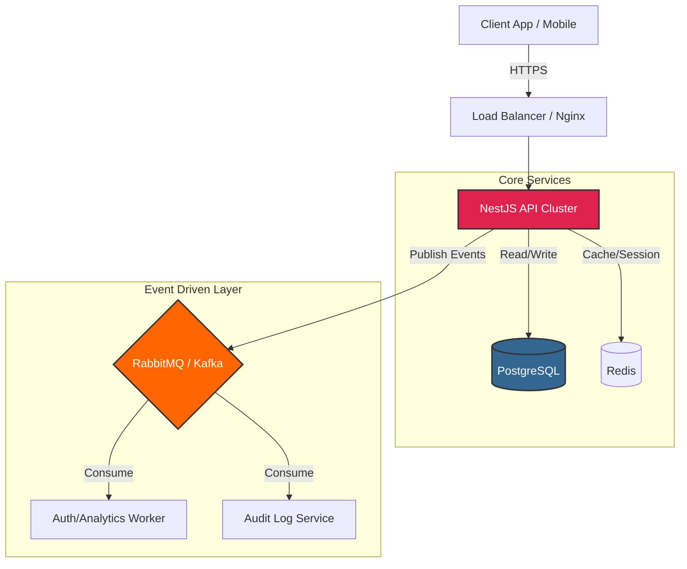

#  Finance API - Enterprise Grade

[](https://nestjs.com/)
[](https://www.typescriptlang.org/)
[](https://www.prisma.io/)
[](https://www.postgresql.org/)
[](https://www.rabbitmq.com/)
[](LICENSE)

> **API Financeira Corporativa** com arquitetura orientada a eventos, autenticação robusta (JWT + Refresh Token), controle de acesso baseado em papéis (RBAC) e observabilidade integrada. Projetada para escalabilidade, segurança e manutenção a longo prazo.

---

## 📑 Índice

- [🚀 Visão Geral](#-visão-geral)
- [🏗️ Arquitetura do Sistema](#️-arquitetura-do-sistema)
- [✨ Funcionalidades Principais](#-funcionalidades-principais)
- [🛠️ Stack Tecnológica](#️-stack-tecnológica)
- [⚡ Quick Start (Docker)](#-quick-start-docker)
- [🔐 Segurança & Autenticação](#-segurança--autenticação)
- [📡 Event-Driven Architecture](#-event-driven-architecture)
- [📖 Documentação da API](#-documentação-da-api)
- [🧪 Testes & Qualidade](#-testes--qualidade)
- [📂 Estrutura do Projeto](#-estrutura-do-projeto)

---

## 🚀 Visão Geral

O **Finance API** é uma plataforma backend completa que demonstra domínio sobre:

1.  **Segurança Avançada**: Implementação de Refresh Tokens rotativos, proteção contra força bruta (Rate Limiting) e sanitização de inputs.
2.  **Arquitetura Escalável**: Separação clara de responsabilidades (Modules), uso de Message Brokers (RabbitMQ/Kafka) para desacoplamento e Prisma ORM para type-safety no banco de dados.
3.  **Controle de Acesso (RBAC)**: Sistema granular de permissões (`ADMIN`, `MANAGER`, `USER`) protegendo rotas críticas.

O projeto prioriza a alta integridade de dados financeiros e segue as melhores práticas de desenvolvimento moderno.

---

## 🏗️ Arquitetura do Sistema



### Fluxo de Autenticação Seguro
1.  **Login**: Usuário envia credenciais → API valida → Retorna `AccessToken` (15min) + `RefreshToken` (7d).
2.  **Acesso**: Cliente usa `AccessToken` no Header `Authorization: Bearer ...`.
3.  **Renovação**: Quando o Access expira, o cliente usa `RefreshToken` na rota `/auth/refresh`.
4.  **Rotação**: O Refresh Token antigo é invalidado no banco e um novo é emitido (prevenção contra replay attacks).
5.  **Evento**: Cada ação de auth dispara um evento assíncrono para auditoria via Broker.

---

## ✨ Funcionalidades Principais

### 🔐 Autenticação & Autorização
- [x] Registro e Login com bcrypt (salt rounds 12).
- [x] JWT Access Tokens de curta duração.
- [x] Refresh Tokens rotativos armazenados no DB.
- [x] Logout seguro (invalidação de token no servidor).
- [x] **RBAC**: Guards decorativos (`@Roles('ADMIN')`).

### 💸 Gestão Financeira
- [x] CRUD de Transações (Receitas/Despesas).
- [x] Categorização automática.
- [x] Endpoint de Resumo (`/summary`) com agregações SQL otimizadas.
- [x] Isolamento total de dados por usuário (Multi-tenancy lógico).

### 🛡️ Hardening & Segurança
- [x] **Helmet**: Headers HTTP seguros.
- [x] **CORS**: Configuração restrita de origens.
- [x] **Rate Limiting**: Proteção contra DDoS/Brute-force (Throttler).
- [x] **Validation Pipe**: Sanitização e validação estrita de DTOs (class-validator).
- [x] **Global Exception Filter**: Tratamento padronizado de erros sem vazamento de stack trace.

### 📡 Observabilidade & Eventos
- [x] Publicação de eventos de Auth (`login`, `register`, `logout`) no Broker.
- [x] Logging estruturado (JSON) com interceptors.
- [x] Health Check endpoint (`/health`) para orquestradores (K8s/Docker).

---

## 🛠️ Stack Tecnológica

| Categoria | Tecnologia | Por que? |
|-----------|------------|----------|
| **Framework** | NestJS 10 | Arquitetura modular, injeção de dependência, escalabilidade. |
| **Linguagem** | TypeScript 5 | Type-safety, manutenibilidade, DX superior. |
| **Database** | PostgreSQL 16 | ACID compliance, confiabilidade para dados financeiros. |
| **ORM** | Prisma | Type-safety no DB, migrations fáceis, auto-complete. |
| **Auth** | Passport + JWT | Padrão da indústria, flexível para múltiplas strategies. |
| **Broker** | RabbitMQ / Kafka | Desacoplamento de serviços, alta throughput de eventos. |
| **Validação** | class-validator | Validação declarativa baseada em decorators. |
| **Docs** | Swagger (OpenAPI) | Documentação interativa gerada automaticamente. |
| **Testes** | Jest + Supertest | Cobertura unitária e E2E robusta. |
| **Infra** | Docker Compose | Ambiente reproduzível e isolado. |

---

## ⚡ Quick Start (Docker)

A maneira mais rápida de rodar o projeto localmente.

### 1. Clone e Configure
```bash
git clone https://github.com/devguilhrm/finance-api.git
cd finance-api
cp .env.example .env
```

### 2. Suba a Infraestrutura
Isso iniciará o PostgreSQL, RabbitMQ e a API.
```bash
docker-compose up -d --build
```

### 3. Execute Migrations
Aplique o schema do banco de dados:
```bash
docker-compose exec api npx prisma migrate deploy
```

### 4. Acesse
- **API**: `http://localhost:3000`
- **Swagger Docs**: `http://localhost:3000/api`
- **RabbitMQ Management**: `http://localhost:15672` (guest/guest)
- **Health Check**: `http://localhost:3000/health`

---

## 🔐 Segurança & Autenticação

### Fluxo de Uso no Frontend

1. **Registrar/Login**:
   ```json
   POST /auth/login
   { 
     "email": "admin@finance.com", 
     "password": "Secret123!" 
   }
   
   # Resposta:
   {
     "accessToken": "eyJhbGciOiJIUz...",
     "refreshToken": "a1b2c3d4...",
     "user": { "id": "uuid", "role": "ADMIN" }
   }
   ```

2. **Chamar Rotas Protegidas**:
   ```http
   GET /transactions
   Authorization: Bearer eyJhbGciOiJIUz...
   ```

3. **Renovar Token (Quando expirar)**:
   ```json
   POST /auth/refresh
   { "refreshToken": "a1b2c3d4..." }
   ```

### RBAC (Role-Based Access Control)

Use o decorator `@Roles()` nos controllers para proteger rotas:

```typescript
@Controller('admin')
@UseGuards(JwtAuthGuard, RolesGuard)
export class AdminController {
  
  @Get('users')
  @Roles('ADMIN') // Apenas admins podem acessar
  findAllUsers() { ... }

  @Get('reports')
  @Roles('ADMIN', 'MANAGER') // Admins e Managers podem acessar
  getReports() { ... }
}
```

---

## 📡 Event-Driven Architecture

A API publica eventos críticos no broker configurado (RabbitMQ por padrão). Isso permite que outros microsserviços reajam sem acoplar código.

**Tópicos/Exchanges Disponíveis:**
- `auth.register`: Disparado ao criar conta.
- `auth.login`: Disparado ao autenticar.
- `auth.token.refresh`: Disparado ao renovar sessão.
- `auth.logout`: Disparado ao encerrar sessão.

**Payload Exemplo:**
```json
{
  "userId": "550e8400-e29b-41d4-a716-446655440000",
  "email": "user@example.com",
  "role": "USER",
  "timestamp": "2024-05-12T14:30:00.000Z",
  "metadata": { 
    "ip": "192.168.1.1", 
    "userAgent": "Mozilla/5.0..." 
  }
}
```

> *Para mudar para Kafka, altere `BROKER_TYPE=kafka` no arquivo `.env`.*

---

## 📖 Documentação da API

A documentação completa e interativa está disponível via Swagger UI.

1. Inicie o projeto.
2. Acesse `http://localhost:3000/api`.
3. Clique em **"Authorize"** e insira seu token JWT (o prefixo `Bearer ` é adicionado automaticamente pelo Swagger).

### Endpoints Principais

| Método | Endpoint | Descrição | Auth Necessária? |
|--------|----------|-----------|------------------|
| `POST` | `/auth/register` | Cria nova conta | ❌ Não |
| `POST` | `/auth/login` | Autentica e retorna tokens | ❌ Não |
| `POST` | `/auth/refresh` | Renova access token | ❌ Não (usa refresh token) |
| `GET` | `/transactions` | Lista transações do usuário | ✅ Sim |
| `POST` | `/transactions` | Cria nova transação | ✅ Sim |
| `GET` | `/transactions/summary` | Saldo, receitas e despesas | ✅ Sim |
| `GET` | `/users/me` | Perfil do usuário logado | ✅ Sim |

---

## 🧪 Testes & Qualidade

O projeto possui cobertura de testes unitários e E2E.

```bash
# Rodar testes unitários
npm run test

# Rodar testes E2E (integração com DB real via Docker)
npm run test:e2e
```

**O que é testado?**
- Validação de DTOs (inputs inválidos).
- Fluxo completo de Auth (Register -> Login -> Refresh -> Logout).
- Isolamento de dados (Usuário A não vê transações do Usuário B).
- Cálculos financeiros precisos no endpoint de Summary.

---

## 📂 Estrutura do Projeto

```text
src/
├── common/                 # Utilitários globais
│   ├── decorators/         # @Roles(), @Public()
│   ├── filters/            # GlobalExceptionFilter
│   ├── guards/             # JwtAuthGuard, RolesGuard
│   ├── interceptors/       # LoggingInterceptor
│   └── events/             # EventsPublisher (Broker)
├── config/                 # Configuração de Env e Validação
├── modules/
│   ├── auth/               # Auth Controller, Service, Strategy
│   ├── users/              # Gestão de Perfil
│   ├── transactions/       # Lógica Financeira
│   └── health/             # Health Check
├── prisma/                 # Schema e Migrations
└── main.ts                 # Entry point da aplicação
```

---

## 📄 Licença

Distribuído sob a licença MIT. Veja `LICENSE` para mais informações.

---

**Feito por [devguilhrm](https://github.com/devguilhrm)**
